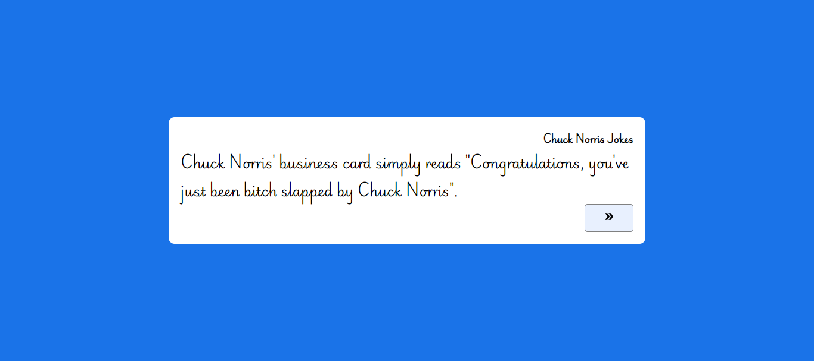

# Chuck Norris Joke Generator



## Introduction

This is a simple React application built with Vite that generates random Chuck Norris jokes. The jokes are fetched from the Chuck Norris API.

## Live Demo

Check out the live demo [here](https://your-live-demo-link.com).

## Features

- Fetches a random Chuck Norris joke from the Chuck Norris API.
- Displays the joke in a styled component.
- Includes a button to fetch a new joke.

## Installation

1. **Clone the repository:**

   ```bash
   git clone https://github.com/ShashikantBharti/chuck-norris-jokes.git
   cd chuck-norris-jokes
   ```

2. **Install dependencies:**

```bash
 npm install
```

3. **Start the development server:**

```bash
npm run dev
```
